<div align="center">


**AI-powered Security Operations Center analyst — local-first, plugin-driven, production-ready.**

Triage, correlate, learn, and respond. NexusSOC ingests alerts from any major SIEM, classifies them with a local or cloud LLM, retrieves prior cases via vector memory, executes response playbooks, and exposes everything through a hardened FastAPI + React stack.

[](LICENSE)
[](https://www.python.org/)
[](https://fastapi.tiangolo.com/)
[](https://react.dev/)
[](https://github.com/pgvector/pgvector)
[](https://docs.docker.com/compose/)

</div>

---

## Table of contents

- [Why NexusSOC](#why-nexussoc)
- [Screenshots](#screenshots)
- [Architecture](#architecture)
- [Feature highlights](#feature-highlights)
- [Tech stack](#tech-stack)
- [Quick start](#quick-start)
- [Configuration](#configuration)
- [Usage](#usage)
- [Project layout](#project-layout)
- [Security](#security)
- [Roadmap](#roadmap)
- [Contributing](#contributing)
- [License](#license)

---

## Why NexusSOC

Most "AI SOC" tools are cloud-only black boxes. NexusSOC is built for analysts who need:

- **Sovereign deployment.** Run the full stack on a single workstation. No alert payload ever leaves your network — unless you opt in via the cloud LLM router.
- **Pluggable everything.** Notification, enrichment, and export plugins are toggled by environment variables. SIEM connectors normalize Wazuh, Elastic, Splunk, QRadar, and generic webhooks into a single schema.
- **Self-learning memory.** Every analyzed case is embedded with `nomic-embed-text` and stored in pgvector. Similar past cases are retrieved at decision time. Analyst feedback updates skill confidence via EMA.
- **Production hygiene.** JWT auth + RBAC, audit log middleware, rate limiting, SSRF guards, security headers, Alembic migrations, Prometheus metrics, dead-letter queue, non-root containers.

---

## Screenshots

<table>
  <tr>
    <td align="center">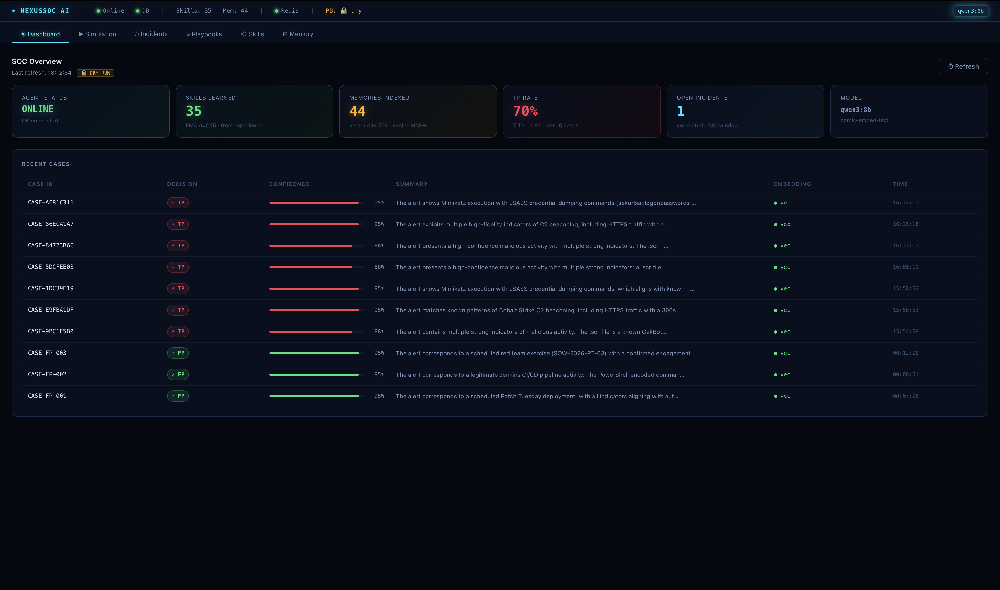<br/><sub><b>Dashboard</b> — health, TP/FP rate, recent activity</sub></td>
    <td align="center">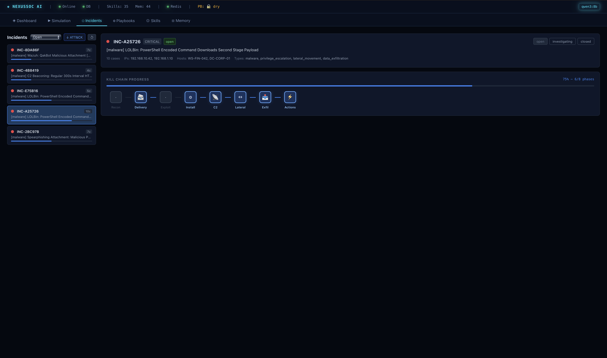<br/><sub><b>Incidents</b> — kill-chain progression and status workflow</sub></td>
  </tr>
  <tr>
    <td align="center">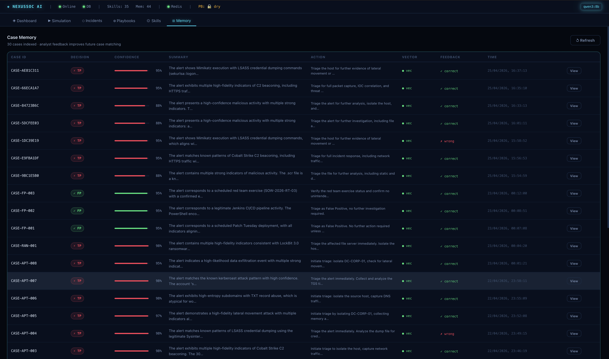<br/><sub><b>Memory</b> — analyzed cases with confidence and feedback</sub></td>
    <td align="center">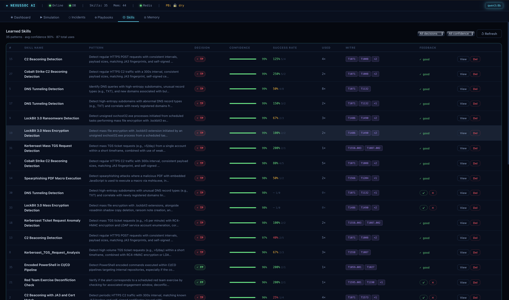<br/><sub><b>Skills</b> — learned detection patterns and confidence trends</sub></td>
  </tr>
  <tr>
    <td align="center">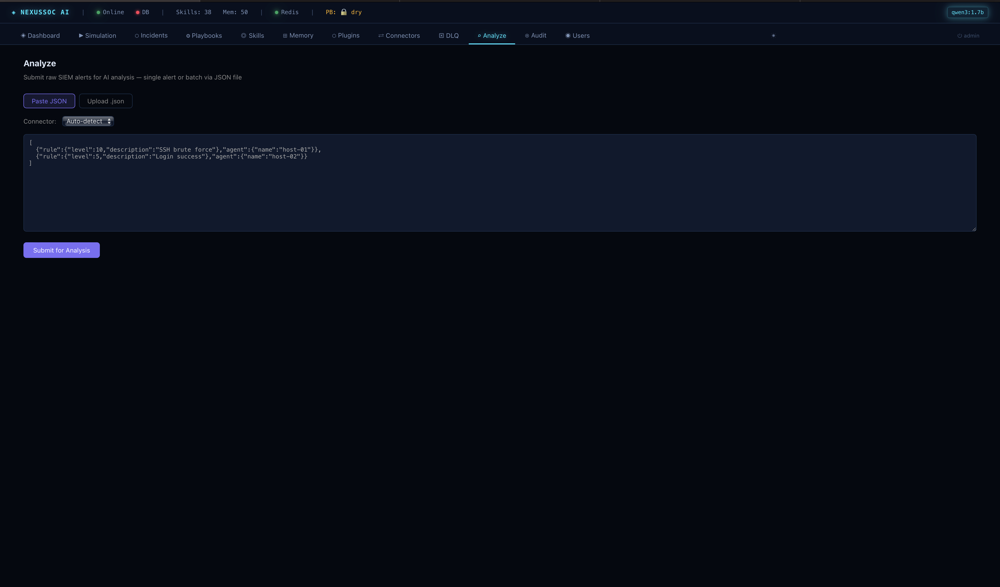<br/><sub><b>Analyze</b> — submit one alert or a batch (paste / upload JSON)</sub></td>
    <td align="center">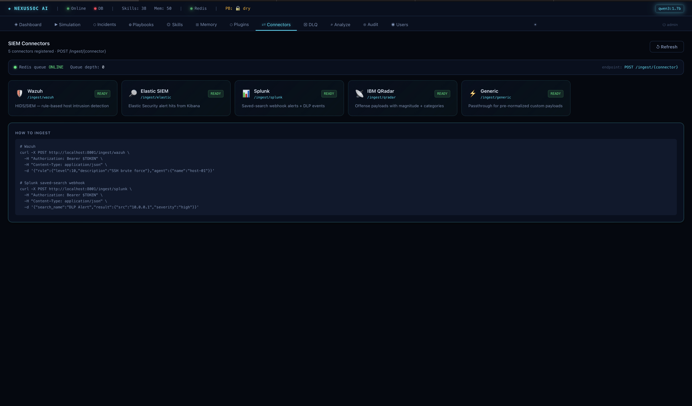<br/><sub><b>Connectors</b> — loaded SIEM connectors (Wazuh / Elastic / Splunk / QRadar / generic)</sub></td>
  </tr>
  <tr>
    <td align="center">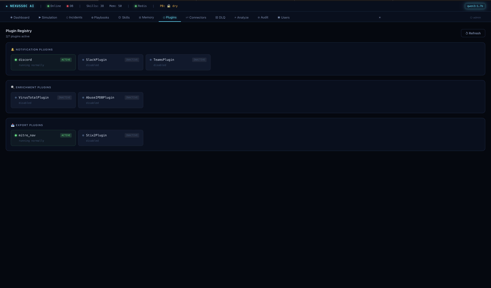<br/><sub><b>Plugins</b> — enrichment / notification / export plugin status</sub></td>
    <td align="center">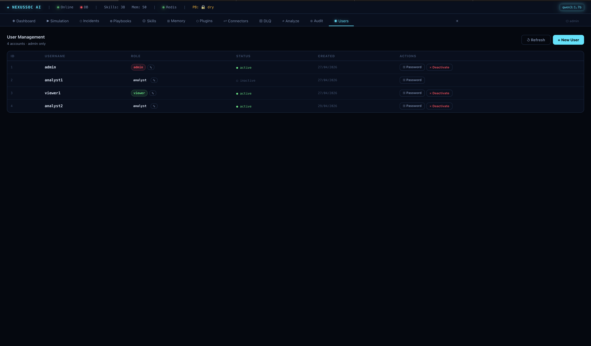<br/><sub><b>Users</b> — RBAC user management (admin only)</sub></td>
  </tr>
</table>

<table>
  <tr>
    <td align="center">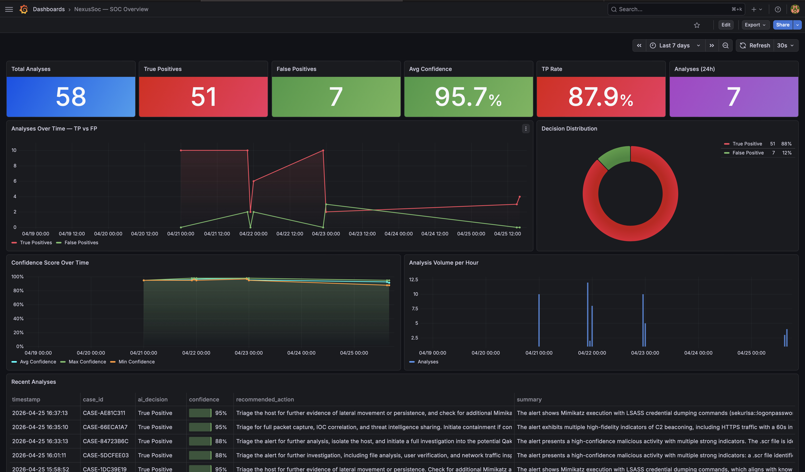<br/><sub><b>Grafana — SOC overview</b></sub></td>
    <td align="center">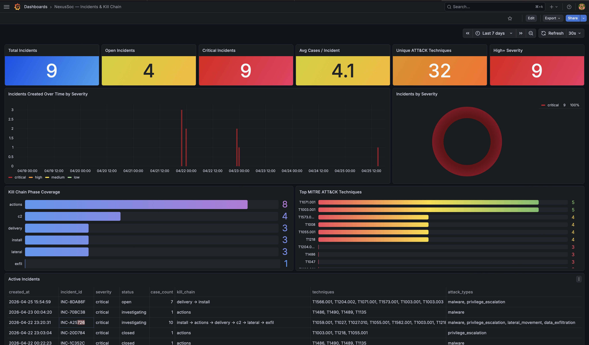<br/><sub><b>Grafana — incidents &amp; kill chain</b></sub></td>
    <td align="center">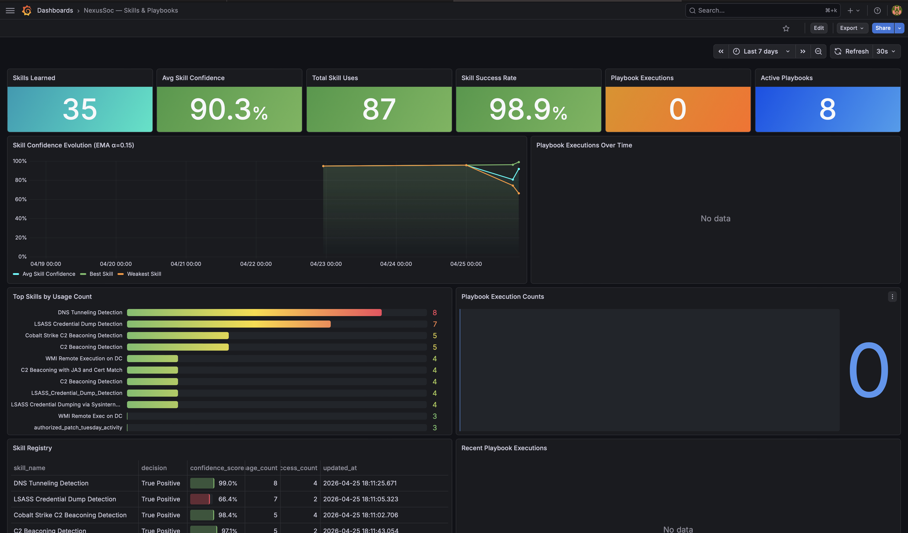<br/><sub><b>Grafana — skills &amp; playbooks</b></sub></td>
  </tr>
</table>

---

## Architecture

```
┌────────────────────────────────────────────────────────────────────────────┐
│                       Detection layer (any SIEM)                            │
│  Wazuh • Suricata • Arkime • Zeek • Elastic • Splunk • QRadar • generic    │
└──────────────────────────────┬─────────────────────────────────────────────┘
                               │ webhook
                               ▼
                  POST /ingest/{connector_name}
                               │ normalize → AlertSchema
                               ▼
        ┌───────────────────────────────────────────────────┐
        │                   NexusSOC API                     │
        │            FastAPI · JWT auth · RBAC               │
        │  ┌─────────────┐  ┌──────────────┐  ┌───────────┐ │
        │  │ Connectors  │  │   Plugins    │  │  Worker   │ │
        │  │ (5 SIEMs)   │  │ enrich/notif │  │ retry+DLQ │ │
        │  └─────────────┘  └──────────────┘  └───────────┘ │
        │                                                    │
        │              ┌─────────────────────┐               │
        │              │     LLM Router      │               │
        │              │  primary + fallback │               │
        │              │ Ollama / OpenAI /   │               │
        │              │ Anthropic           │               │
        │              └──────────┬──────────┘               │
        │                         │                          │
        │  ┌──────────────────────┴─────────────────────┐    │
        │  │ pgvector memory · skills · incidents · DLQ │    │
        │  │ Postgres 15 + Alembic migrations            │    │
        │  └────────────────────────────────────────────┘    │
        └───────────────────────────────────────────────────┘
                               │
            ┌──────────────────┼─────────────────────┐
            ▼                  ▼                     ▼
      React frontend      Prometheus +          Notification
      (Vite + JWT)         Grafana              plugins
                                                Discord · Slack · Teams
```

---

## Feature highlights

### LLM router with fallback chain (Phase 2.2)
Pick a primary backend with `LLM_BACKEND=ollama|openai|anthropic` and configure a comma-separated `LLM_FALLBACK_CHAIN`. The router walks the chain on `LLMError`, dedupes entries, and skips backends that lack credentials. Embedding stays pinned to Ollama because changing the embed model invalidates the pgvector store.

### Pluggable architecture
| Category | Provided |
|---|---|
| **Notification** | Discord, Slack, Microsoft Teams |
| **Enrichment** | VirusTotal, AbuseIPDB *(passive stubs — extend via `EnrichmentPlugin`)* |
| **Export** | MITRE ATT&CK Navigator layer, STIX 2.1 bundle |
| **SIEM connectors** | Wazuh, Elastic Security, Splunk, QRadar, generic |

Each plugin is loaded from a hard-coded whitelist registry (`plugins/loader.py`) — no dynamic user import path, no plugin name controlled by request input.

### Self-learning memory
Every case is embedded with `nomic-embed-text` (768-dim) into Postgres + pgvector. Similar past cases are retrieved via cosine similarity at decision time. Analyst feedback updates skill confidence using EMA with `α = 0.15`. High-confidence skills (`≥ 0.85`) are extracted automatically and reused on future alerts.

### Security hardening
- JWT auth (`python-jose`) with RBAC: `viewer / analyst / admin`
- Refresh-token rotation with Redis revocation blocklist
- Last-admin guard, self-demotion guard, soft-delete with audit trail
- Sliding-window rate limiter (per-IP, per-path) backed by Redis
- 1 MB request size cap; OWASP security headers; opt-in HSTS
- SSRF guard on every outbound webhook (RFC1918 + link-local + IPv6 private blocked)
- Audit log middleware writes every meaningful API call to `audit_logs`
- Non-root Docker user; backend / frontend network isolation
- `JWT_SECRET` enforced ≥ 32 chars when `AUTH_ENABLED=true`

### Observability
- Prometheus instrumentator at `/metrics`
- Custom metrics: `nexussoc_alerts_total{decision,source}`, `nexussoc_analysis_duration_seconds`, `nexussoc_confidence_score`, `nexussoc_queue_depth`
- Grafana provisioned with datasource and dashboard at boot
- Per-dependency `/health` with latency, worker heartbeat, plugin status, connector list, LLM router state

### Worker reliability
Standalone Docker service. Exponential backoff (2 → 4 → 8 s), `MAX_RETRIES=3`, dead-letter queue at `nexussoc:dlq`. Inspect dead jobs via `GET /queue/dlq` (admin role).

### Modern UX
React + Vite frontend with seven panels, theme toggle, STIX 2.1 export, audit log viewer, user manager, and a dead-letter inspector.

---

## Tech stack

| Layer | Stack |
|---|---|
| **Backend** | Python 3.11, FastAPI 0.104, Pydantic v2, asyncpg, Alembic, httpx |
| **Auth** | python-jose, passlib + bcrypt 4.0.1, Redis revocation list |
| **Frontend** | React 18, TypeScript, Vite, JWT context, localStorage feedback |
| **Database** | PostgreSQL 15 + pgvector (HNSW index) |
| **Queue** | Redis 7 |
| **LLM** | Ollama (local) · OpenAI · Anthropic — selected by env |
| **Observability** | Prometheus + Grafana (auto-provisioned) |
| **Packaging** | Docker Compose, Makefile, GitHub Actions CI + release |

| Service | Port |
|---|---|
| AI Agent API | `8001` |
| SOC Frontend | `5173` |
| Grafana | `3000` |
| Prometheus | `9090` |
| Postgres | `5432` |
| Redis | `6379` |
| Ollama | `11434` |

---

## Quick start

### Requirements
- Docker + Docker Compose
- (Optional) [Ollama](https://ollama.com) on the host if you want local LLM inference

### 1. Clone and configure
```bash
git clone https://github.com/<your-org>/NexusSOC.git
cd NexusSOC
cp ai_agent_src/.env.example .env
```

Edit `.env`:
- Set `DB_PASS` to a strong value
- Set `JWT_SECRET` (`python -c "import secrets; print(secrets.token_hex(32))"`)
- Set `ADMIN_PASSWORD` for the initial admin seed
- Pick `LLM_BACKEND` (default `ollama`) and add provider keys if you select cloud

### 2. Pull the embedding model (and optionally a local LLM)
```bash
ollama pull nomic-embed-text   # required — DO NOT change after first run
ollama pull qwen3:1.7b         # default LLM; swap for a larger model if your hardware allows
```

| Hardware | Suggested model |
|---|---|
| 4 GB RAM | `qwen3:1.7b` |
| 8 GB RAM | `mistral:7b`, `llama3.1:8b` |
| 16 GB RAM | `qwen3:14b` |
| 24 GB+ | `qwen3:32b` |

### 3. Boot the stack
```bash
make up                         # full stack
# or
docker compose up --build
```

### 4. Open the platform
| Surface | URL |
|---|---|
| SOC Frontend | http://localhost:5173 |
| API docs (Swagger) | http://localhost:8001/docs |
| Health | http://localhost:8001/health |
| Metrics | http://localhost:8001/metrics |
| Grafana | http://localhost:3000 |

Default Grafana login: `admin` / your `DB_PASS`.

### 5. Seed playbooks (first run)
```bash
make seed
# or
python ai_agent_src/seed_playbooks.py http://localhost:8001
```

### 6. Run the SOC pipeline simulation (optional)
```bash
python ai_agent_src/shuffle_simulation.py
```

The simulator drives 16 scenarios (ransomware, APT, insider, web, DNS exfil) end-to-end through Shuffle SOAR → MISP / Cortex / OpenCTI → TheHive → NexusSOC. Results land in `sim_results.json`.

---

## Configuration

All configuration is environment-driven. See `ai_agent_src/.env.example` for the full reference. Key sections:

| Section | Variables |
|---|---|
| **Database** | `DB_HOST`, `DB_PORT`, `DB_USER`, `DB_PASS`, `DB_NAME` |
| **Redis** | `REDIS_URL` |
| **LLM router** | `LLM_BACKEND`, `LLM_FALLBACK_CHAIN` |
| **Ollama** | `OLLAMA_HOST`, `OLLAMA_PORT`, `OLLAMA_MODEL`, `EMBED_MODEL` |
| **OpenAI** | `OPENAI_API_KEY`, `OPENAI_MODEL`, `OPENAI_BASE_URL` |
| **Anthropic** | `ANTHROPIC_API_KEY`, `ANTHROPIC_MODEL`, `ANTHROPIC_MAX_TOKENS` |
| **Auth** | `AUTH_ENABLED`, `JWT_SECRET`, `ACCESS_TOKEN_EXPIRE_MINUTES`, `REFRESH_TOKEN_EXPIRE_DAYS`, `ADMIN_USERNAME`, `ADMIN_PASSWORD`, `API_KEY` |
| **CORS / HTTPS** | `CORS_ORIGINS`, `HTTPS_ONLY` |
| **Plugins** | `PLUGIN_DISCORD_ENABLED`, `PLUGIN_SLACK_ENABLED`, `PLUGIN_TEAMS_ENABLED`, `PLUGIN_VT_ENABLED`, `PLUGIN_ABUSEIPDB_ENABLED`, `PLUGIN_MITRE_EXPORT_ENABLED`, `PLUGIN_STIX2_ENABLED` and their `*_WEBHOOK` / `*_API_KEY` companions |
| **Batch ingest** | `BATCH_MAX_ALERTS` (default `100`) — max alerts per `POST /ingest/batch` |
| **Playbooks** | `PLAYBOOK_DRY_RUN` |

> ⚠️ Changing `EMBED_MODEL` after first boot invalidates every embedded case in pgvector. Pick once, keep forever.

---

## Usage

### Ingesting alerts
```bash
curl -X POST http://localhost:8001/ingest/wazuh \
  -H "Authorization: Bearer $TOKEN" \
  -H "Content-Type: application/json" \
  -d @samples/wazuh_alert.json
# 202 Accepted — { "job_id": "...", "case_id": "WAZUH-...", "status": "queued" }
```

Available connectors: `wazuh`, `elastic`, `splunk`, `qradar`, `generic`. List them with `GET /connectors`.

### Batch ingest
```bash
curl -X POST http://localhost:8001/ingest/batch \
  -H "Authorization: Bearer $TOKEN" \
  -H "Content-Type: application/json" \
  -d '{"connector_name":"wazuh","alerts":[{...},{...}]}'
# 202 → { "results":[...], "total":N, "succeeded":S, "failed":F }
# 413 if N > BATCH_MAX_ALERTS (default 100). Omit connector_name to auto-detect per alert.
```

The frontend exposes the same endpoint via the **Analyze** tab — paste raw JSON or upload a `.json` file containing one alert or an array.

### Synchronous analysis
```bash
curl -X POST http://localhost:8001/analyze-case \
  -H "Authorization: Bearer $TOKEN" \
  -H "Content-Type: application/json" \
  -d @samples/normalized_alert.json
```

### Inspect health and LLM router
```bash
curl http://localhost:8001/health | jq '.services.llm'
# { "primary": "ollama", "fallback_chain": ["openai"], "available": { ... } }
```

### Make targets
```bash
make up        # docker compose up
make dev       # hot-reload backend
make minimal   # api + db + redis only (no Ollama, requires cloud LLM)
make migrate   # alembic upgrade head
make seed      # load demo playbooks
make test      # pytest
make lint      # ruff + mypy
make clean     # stop + drop volumes
```

---

## Project layout

```
NexusSOC/
├── ai_agent_src/                 # FastAPI backend
│   ├── main.py                   # API surface
│   ├── auth.py                   # JWT + RBAC + user CRUD
│   ├── security.py               # middleware: headers, rate limit, audit, SSRF
│   ├── correlator.py             # incident correlation + kill chain
│   ├── playbooks.py              # playbook engine
│   ├── worker.py                 # standalone background worker
│   ├── llm/                      # LLM abstraction (Phase 2.2)
│   │   ├── base.py
│   │   ├── ollama.py
│   │   ├── openai.py
│   │   ├── anthropic.py
│   │   └── router.py
│   ├── plugins/                  # enrichment / notification / export
│   ├── connectors/               # Wazuh / Elastic / Splunk / QRadar / generic
│   ├── migrations/               # Alembic async migrations
│   ├── shuffle_simulation.py     # SOC pipeline demo
│   ├── seed_playbooks.py
│   └── Dockerfile
│
├── soc-frontend/                 # React + Vite + TypeScript
│   ├── src/
│   │   ├── components/           # Dashboard, Incidents, Memory, Skills, Playbooks,
│   │   │                         # Audit, Users, Plugins, Connectors, DLQ, Login
│   │   ├── contexts/AuthContext.tsx
│   │   ├── lib/api.ts
│   │   └── styles/global.css
│   └── Images/                   # screenshots
│
├── grafana/
│   ├── prometheus.yml
│   ├── provisioning/             # datasource + dashboards
│   └── Images/                   # screenshots
│
├── .github/workflows/            # ci.yml + release.yml
├── docker-compose.yml
├── Makefile
└── README.md
```

---

## Security

NexusSOC ships with a defensive baseline. Highlights:

- **Zero hardcoded secrets.** Required env vars validated at startup; `.env` is gitignored at every level.
- **JWT secret strength enforced.** Boot fails if `JWT_SECRET` is shorter than 32 characters when auth is enabled.
- **Brute-force protection.** `/auth/login` is rate-limited to 5 requests/minute per IP.
- **SSRF guard** on every outbound webhook: rejects localhost, RFC1918, link-local, and IPv6 ULA.
- **No dynamic plugin imports.** The plugin loader uses a hard-coded whitelist registry.
- **No `eval`, `exec`, `pickle`, `yaml.load`, or `shell=True`** anywhere in the codebase.
- **Audit trail** for every state-changing endpoint with username, IP, status, and duration.
- **Non-root containers** with network isolation (frontend ↔ api only; api ↔ db / redis / ollama).
- **Playbooks default to `DRY_RUN`.** Real webhook actions only fire when `PLAYBOOK_DRY_RUN=false`.

If you discover a security issue, please open a private advisory on GitHub rather than a public issue.

---

## Roadmap

- [x] Phase 1 — Security hardening (auth, rate limiting, SSRF, audit)
- [x] Phase 2.1 — Plugin architecture (enrichment / notification / export)
- [x] Phase 2.2 — Multi-LLM router (Ollama / OpenAI / Anthropic + fallback chain)
- [x] Phase 2.3 — Multi-SIEM connectors (Wazuh / Elastic / Splunk / QRadar / generic)
- [x] Phase 3 — Observability (Prometheus + Grafana), Alembic migrations, worker DLQ, expanded `/health`
- [x] Phase 4 — Open-source packaging (Makefile, GitHub Actions CI + release)
- [x] Phase 5 — UX (theme toggle, STIX 2.1 export, admin panels, DLQ inspector)
- [x] Batch ingest — `POST /ingest/batch` + Analyze panel (paste / upload JSON, optional connector auto-detect, capped by `BATCH_MAX_ALERTS`)
- [ ] Phase 6 — Documentation site (`mkdocs-material`) + plugin authoring guide
- [ ] Optional vector store providers beyond pgvector

---

## Contributing

PRs are welcome. The project follows conventional commits and ships with `ruff`, `mypy`, and `bandit` wired into CI. Before opening a PR:

```bash
make lint    # ruff + mypy
make test    # pytest
```

For larger changes, please open an issue first to discuss the design.

---

## License

Released under the [MIT License](LICENSE).

---

<div align="center">

Built as a graduation project. Contributions, issues, and stars are appreciated.

</div>
